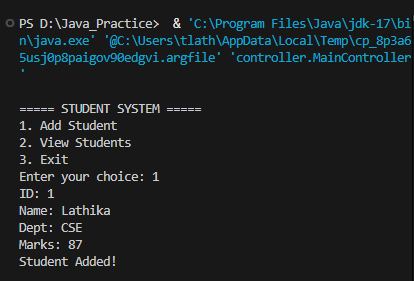
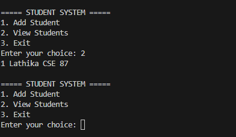

# 🎓 Student Management System (Java + MySQL)

## 📌 Project Overview
This is a Java-based Student Management System developed using JDBC and MySQL.  
It follows MVC architecture with proper separation of layers (Controller, Service, DAO, Model).

---

## 🚀 Features
- Add Student
- View All Students
- Update Student
- Delete Student
- Search Student
- MySQL Database Integration
- MVC Architecture Design

---

## 🛠️ Tech Stack
- Java (JDK 17)
- JDBC
- MySQL
- VS Code

---

## 🧱 Project Structure
model/
dao/
service/
controller/
db/

---

## ▶️ How to Run
1. Clone the repository
2. Import project in VS Code / Eclipse
3. Setup MySQL database
4. Update DB credentials in DBConnection.java
5. Run `MainController.java`

---

## 📸 Output Preview

---

## 💡 What I Learned
- JDBC Connection
- CRUD Operations
- MVC Architecture
- MySQL Integration
- Project Structuring

---

## 👨‍💻 Author
- Lathika